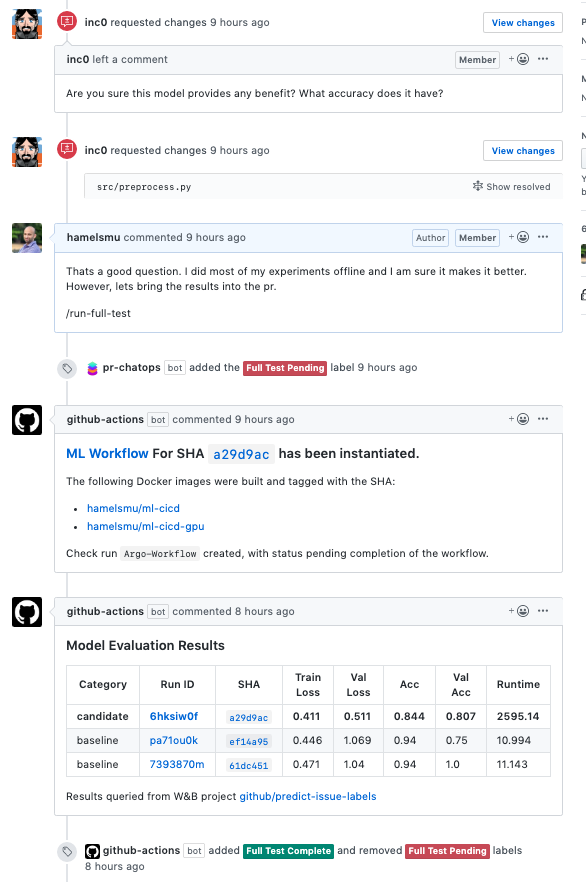

# A Collection of GitHub Actions That Facilitate MLOps

## A Collection Of GitHub Actions That Enable MLOps and CI/CD For Machine Learning:

Below is a collection of GitHub Actions that we are curating or building that facilitate machine learning workflows:

### 1. ChatOps
   - [Action: ChatOps From Pull Requests](https://github.com/marketplace/actions/chatops-for-pull-requests): Listens to ChatOps commands in PRs and emits variables that downstream Actions can branch on.

### 2. Submitting Argo workflows
[Argo](https://argoproj.github.io/) allows you to orechestrate machine learning pipelines that run on Kubernetes.

  - [Action: Submit Argo Workflows on GKE](https://github.com/marketplace/actions/submit-argo-workflows-to-gke) - leverages the gcloud cli to authenticate to your GKE cluster and submit argo workflows.
  - [Action: Submit Argo Workflows on K8s (Cloud agnostic)](https://github.com/marketplace/actions/submit-argo-workflows-from-github) - requires that you supply a kubeconfig file to authenticate to your k8 cluster.

### 3. Query Experiment Tracking Results
  - [Action: Fetch runs from Weights & Biases](https://github.com/marketplace/actions/get-runs-from-weights-biases) - W&B is an experiment tracking and logging system for machine learning, and is free for open source projects.

### 4. Publish Docker Images
  - [Action: Publish Container To The GitHub Package Registry](https://github.com/marketplace/actions/publish-docker-images-to-gpr).  See this [doc](https://github.com/features/package-registry) on more information on the GitHub Package Registry
  - [Action: Publish Container To a Generic Registry](https://github.com/marketplace/actions/publish-docker)

## What is MLOps?  

See [this demo](https://youtu.be/Ll50l3fsoYs) explaining this project and more background on what MLOps is and why it is needed.

## Example Of What We Are Trying To Solve With MLOps:

The code-review process re: Machine Learning often involves making decisions about merging or deploying code where critical information regarding model performance and statistics are not readily available.  This is due to the friction in including logging and statistics from model training runs in Pull Requests.  For example, consider this excerpt from a [real pull-request](https://github.com/kubeflow/code-intelligence/pull/54) concerning a machine learning project:

>

In an ideal world, the participants in the above code review should be provided with all of the context necessary to evaluate the PR, including:

- Model performance metrics and statistics
- Comparison with baselines and other models on a holdout dataset
- Verification that the metrics and statistics correspond to the code changed in the PR, by tying the results to a commit SHA.
- Data versioning
- etc.

### How We Can Solve This With GitHub Actions:

[GitHub Actions](https://github.com/features/actions) allow you to compose a set of pre-built CI/CD tools or make your own, allowing you to compose a workflow that enables MLOps from GitHub.  The below example composes the following Actions into useful pipeline:

 [ChatOps](https://github.com/marketplace/actions/chatops-via-pr-labels) &rightarrow; [Deploy Argo ML Workflows](https://github.com/machine-learning-apps/gke-argo) &rightarrow;  [Weights & Biases Experiment Tracking](https://github.com/machine-learning-apps/wandb-action):

>

View the demo pull request [here](https://github.com/machine-learning-apps/actions-ml-cicd/pull/23).  What is shown above is only the tip of the iceberg! 
